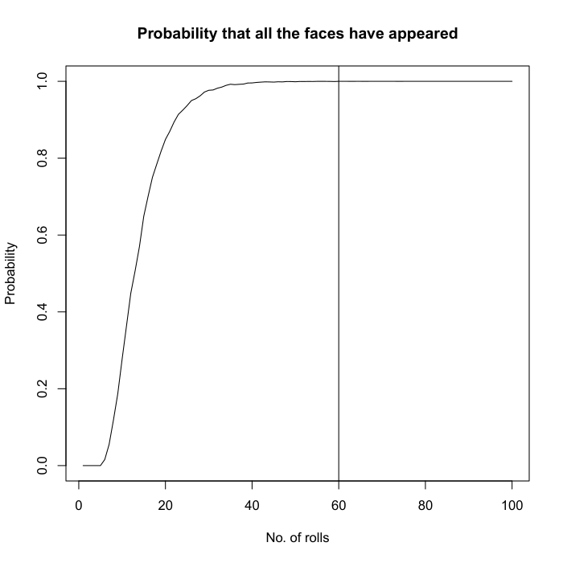
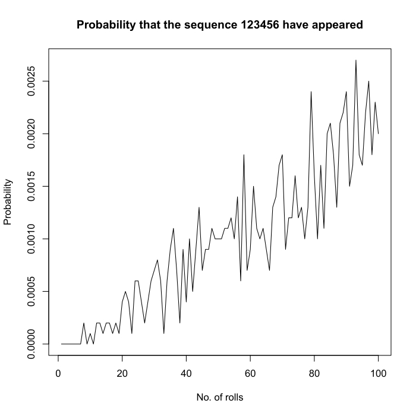
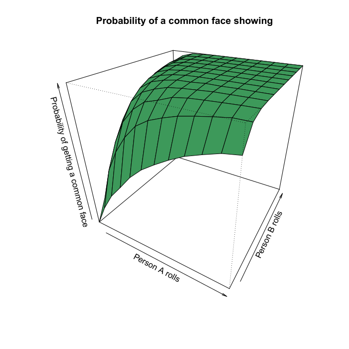
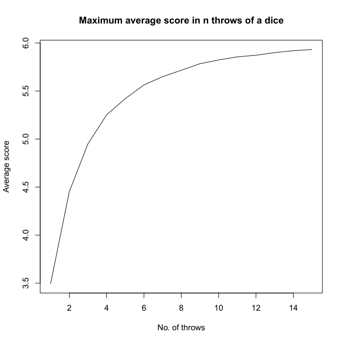
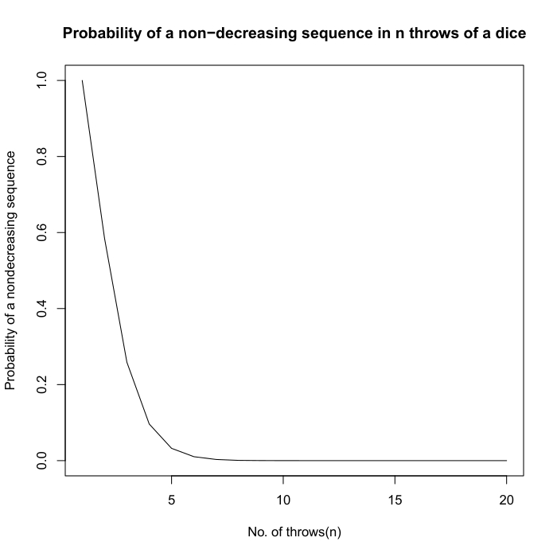

#	SOME PROBLEMS ON DICE, THEIR MATHEMATICAL TREATMENTS AND SIMULATIONS

#####  Abstract
Life is like a bivouac filled with randomness and adventure. In this random aspect of life, we come across some ordinary, rather home-do-able events that make things fascinating and brings our minds to thoughts of action which speak louder than words. Keeping these things in mind, a throw of a die is probably one of the first experiments as we have learned in probability. The things we have learned are more theoretical than practical perspectives. To enlighten upon the practical aspect of this turn, we must bring in some verification to some generalized aspects and notions. This verification is done with the help of simulation. We know that each probabilistic problem has a journey on its own. We have tried our best to highlight most of it along with simulation and have tried to display a visualization of some engrossing features each problem consists of. The use of the Markov Chain in solving problems has been a real pleasure to make things even more interesting.

### Part 1: Introduction
On constant thought of action, a throw of a die is a random event from a probabilistic aspect. On the hint of such randomness there are some basic yet interesting problems and extensions that can be raised as we constantly work on problems related to this. Let's answer some questions howsoever to work through.
######  Note-
We set the seed of our simulation codes at 20 so as to have some sort of reproducibility in our results
```
set.seed(20)
```

### Part 2: The Questions and their Treatments
####  1.  On an average, how many times must a 6-sided die be rolled until a 6 turns up?
Seems like an easy enough problem, isn't it?
In other words we are asked to find expected no. of rolls until a 6 appear.
Then probability that $X=1$ is $\frac{1}{6}$, $X=2$ is $\frac{5}{6}\times\frac{1}{6}=\frac{5}{36}$.
In general prob that $X=k$ is
$$P\left(X=k\right)=\left(\frac{5}{6}\right)^{k-1}\frac{1}{6}\quad,k=1,2,\ldots$$
Since in order for $x$ to be $k$, there must be $(k-1)$ rolls which can be any of the numbers 1 to 5, and then 6, which appears with probability $\frac{1}{6}$.
We seek the expectation of $X$.
```math
\begin{align}
E\left(X\right) & =\sum_{n=1}^{\infty}nP\left(x=n\right)\\
\Rightarrow E\left(X\right) & =\sum_{n=1}^{\infty}n\left(\frac{5}{6}\right)^{n-1}\cdot\frac{1}{6}=\frac{6}{5}\cdot\frac{1}{6}\sum_{n=1}^{\infty}n\left(\frac{5}{6}\right)^{n}\\
 & =\frac{1}{5}\sum_{n=1}^{\infty}n\left(\frac{5}{6}\right)^{n}\quad\text{ Which is an AGP series }\\
 & =\frac{1}{5}\left(\frac{\frac{5}{6}}{1-\left(\frac{5}{6}\right)^{2}}\right)\\
 & =\frac{1}{5}\times\frac{5}{6}\times\frac{36}{1}\\
 & =6
\end{align}
```
Thus on an average it takes 6 throws of a die before a 6 appears.
######  Simulation
We do the simulation in the following manner:
```
rolls<-function()
{
	x<-sample(1:6,1)
	i=1
	while(x!=6)
	{
		x<-sample(1:6,1)
		i=i+1
	}
	return(i)
}
mean(replicate(10000,rolls()))
```
Upon doing the simulation, we get the value as: `6.0523`. Taking the mean from 5 times the above calculation, we also do a simulation to get a better estimate:
```
mean(replicate(5,mean(replicate(10000,rolls()))))
```
This returns a value of `6.018`
######  Conclusion
We have observed by using simulation that the expected value of rolling a die until a 6 turns up is almost equal to 6. This verifies the probabilistic approach we used to find an answer to this question. The more the sample, the closer will be the result of the simulation to the number 6, as we found out in our comparative simulation.
####  2.	On an average, how many times must a 6-sided die be rolled until a 6 turns up twice a row?
We use recurrence relation to solve this, Let $E(X)$ be expected
no. of rolls. When we start rolling, we expect, on average 6 rolls
until a 6 shows up. Once that happens, there is a $\frac{1}{6}$ chance
we will roll once more and a $\frac{5}{6}$ chance that we will be
effectively starting all over again, and so have as many starting
all over again, and so have as many additional rolls as when we started,
we say,
```math
\begin{align}
E\left(X\right) & =6+\frac{1}{6}+\frac{5}{6}\left(E\left(X\right)+1\right)\\
\implies\frac{1}{6}E\left(X\right) & =6+\frac{1}{6}+\frac{5}{6}\\
\implies E\left(X\right) & =42
\end{align}
```
Thus, on an average 42 is no. of times needed for a dice to be rolled until 6 appears twice in a row.
######	Simulation
We do the simulation in the following manner:
```
rolls<-function()
{
	j=0
	x<-sample(1:6,1)
	i=1
	if(x==6)
	{
		j=1
		x<-sample(1:6,1)
		i=i+1
		if(x!=6) j=0
	}
	while(j!=1)
	{
		x<-sample(1:6,1)
		i=i+1
		if(x==6)
		{
			j=1
			x<-sample(1:6,1)
			i=i+1
			if(x!=6) j=0
		}
	}
	return(i)
}
mean(replicate(10000,rolls()))
```
Upon running this, we found the value to be: `41.5374`.Taking the mean from 5 times the above calculation, we also do a simulation to get a better estimate:
```
mean(replicate(5,mean(replicate(10000,rolls()))))
```
This returns the value: `42.32468`
######	Conclusion
We have observed by using simulation that the expected value of rolling
a die until a 6 turns up twice in a row is almost equal to 42. This
verifies the probabilistic approach we used to find an answer to this
question. The more the sample, the closer will be the result of the
simulation to the number 42, as we found out in our comparative simulation.
####	3.	On average, how many times must a 6-sided die be rolled until the sequence 65 appears (that is a 6 followed by a 5)?
In this problem, once we roll a 6 there are 3 possibilities:
- We roll a 5
- We roll a 6
- We start over again

We again use recursion, but we will have two simultaneous equations.
Let $E$ be the expected number of rolls until 65 and let $E_{6}$
be the expected number of rolls until 65 when we start with a rolled
6. Then
```math
\begin{align}
E_{6} & =\frac{1}{6}\left(E_{6}+1\right)+\frac{4}{6}\left(E+1\right)+\frac{1}{6}\times1\\
E & =\frac{1}{6}\left(E_{6}+1\right)+\frac{5}{6}\left(E+1\right)
\end{align}
```
On solving both, we have
$$E=36\;E_{6}=30$$
######	Simulation
We do the simulation in the following manner:
```
rolls<-function()
{
	j=0
	x<-sample(1:6,1)
	i=1
	while(x==6)
	{
		j=1
		x<-sample(1:6,1)
		i=i+1
		if(x!=5) j=0
	}
	while(j!=1)
	{
		x<-sample(1:6,1)
		i=i+1
		while(x==6)
		{
			j=1
			x<-sample(1:6,1)
			i=i+1
			if(x!=5) j=0
		}
	}
	return(i)
}
mean(replicate(10000,rolls()))
```
Upon running this, we found the value to be: `35.7654`.Taking the mean from 5 times the above calculation, we also do a simulation to get a better estimate:
```
mean(replicate(5,mean(replicate(10000,rolls()))))
```
This returns the value: `36.07392`
######	Corollary: It takes lesser rolls on an average to see a 6 followed by a 5 than for 6 followed by 6.
######	Conclusion
We have observed by using simulation that the expected value of rolling a die until a 6 turns up followed by a 5 is almost equal to 36. This verifies the probabilistic approach we used to find an answer to this question. The more the sample, the closer will be the result of the simulation to the number 36, as we found out in our comparative simulation.
####	4.	On average, how many times must a 6-sided die be rolled until there are two rolls in a row that differ by 1(such as a 2 followed by a 1 or 3, or a 6 followed by a 5)? What if we roll until there are two rolls in a row that differ by no more than 1(so we stop at a repeated roll, too)?
Let $E$ be the expected no. of rolls. Let $E_{i}$ be the expected
no. of rolls after rolling an $i$ (not following a roll of $i-1$
or $i+1$). Then, we have
$$E=1+\frac{1}{6}\left(E_{1}+E_{2}+E_{3}+E_{4}+E_{5}+E_{6}\right)$$
By symmetry, we have $E_{1}=E_{6},E_{2}=E_{5},E_{3}=E_{4}$ and
thus
$$E=1+\frac{2}{6}\left(E_{1}+E_{2}+E_{3}\right)$$
We can also right $E_{1}$as $E_{1}=1+\frac{2}{6}E_{1}+\frac{1}{6}E_{2}+\frac{2}{6}E_{3}$.
Since there will be an additional roll, there is a $\frac{1}{6}$
chance that this will be the last roll (i.e. we roll a 2) and five
other possibilities are equally likely. Similarly, $E_{2}=1+\frac{1}{6}E_{1}+\frac{2}{6}E_{2}+\frac{1}{6}E_{3}$
and $E_{3}=1+\frac{2}{6}E_{1}+\frac{1}{6}E_{2}+\frac{1}{6}E_{3}$.
Thus, after solving, we get,
$$E_{1}=\frac{70}{17}, E_{2}=\frac{58}{17}, E_{3}=\frac{60}{17}$$
Thus, we get that,
$$E=1+\frac{1}{3}\times\left(\frac{70+58+60}{17}\right)=\frac{239}{51}=4.6862$$
######	Simulation
We do the simulation in the following manner:
```
rolls<-function()
{
	x<-sample(1:6,1);y<-sample(1:6,1)
	i=2
	while(abs(x-y)!=1)
	{
		x<-y;y<-sample(1:6,1)
		i=i+1
	}
return(i)
}
mean(replicate(10000,rolls()))
```
Upon running this, we found the value to be: `4.702`. Taking the mean from 5 times the above calculation, we also do a simulation to get a better estimate:
```
mean(replicate(5,mean(replicate(10000,rolls()))))
```
This returns the value: `4.69556`
######	Conclusion for first part
We have observed by using simulation that the expected value of rolling
a die until there are two rolls in a row that differ by 1 is almost
equal to 4.6862. This verifies the probabilistic approach we used
to find an answer to this question. The more the sample, the closer
will be the result of the simulation to the number 36, as we found
out in our comparative simulation.

If we stop when we have a repeated roll too, a similar situation arises.
Defining $E,E_{1},E_{2},E_{3}$ as same, we have
```math
\begin{align}E & =1+\frac{2}{6}\left(E_{1}+E_{2}+E_{3}\right)\\
E_{1} & =1+\frac{1}{6}E_{1}+\frac{1}{6}E_{2}+\frac{2}{6}E_{3}\\
E_{2} & =1+\frac{1}{6}E_{1}+\frac{1}{6}E_{2}+\frac{1}{6}E_{3}\\
E_{3} & =1+\frac{2}{6}E_{1}+\frac{1}{6}E_{2}
\end{align}
```
Solving, we get,
```math
\begin{align}
E_{1} & =\frac{288}{115},\;E_{2}=\frac{246}{115},\;E_{3}=\frac{252}{115}\\
E & =1+\frac{1}{3}\left(\frac{288+246+252}{115}\right)=\frac{377}{115}=3.278
\end{align}
```
######	Simulation
We do the simulation in the following manner:
```
rolls<-function()
{
	x<-sample(1:6,1);y<-sample(1:6,1)
	i=2
	while(abs(x-y)>1)
	{
		x<-y;y<-sample(1:6,1)
		i=i+1
	}
return(i)
}
mean(replicate(10000,rolls()))
```
Upon running this, we found the value to be: `3.247`. Taking the mean from 5 times the above calculation, we also do a simulation to get a better estimate:
```
mean(replicate(5,mean(replicate(10000,rolls()))))
```
This returns the value: `3.29216`
######	Conclusion for second part
We have observed by using simulation that the expected value of rolling a die until there are two rolls in a row that differ by at most 1 is almost equal to 3.278. This verifies the probabilistic approach we used to find an answer to this question. The more the sample, the closer will be the result of the simulation to the number 3.278, as we found out in our comparative simulation.
######	Corollary: The expected values of rolls until there are two rolls in a row that differ by 1 is greater than the expected number of rolls until there are two rolls in a row that differ by no more than 1
####	5.	We roll 6-sided die $n$ times. What is the probability that all faces have appeared?
Let $P\left(n\right)$ stand for the probability that all the faces
have appeared in $n$ rolls. To determine $P\left(n\right)$, we use
inclusion-exclusion principle. We wished to count the no. of rolls
that do not contain all the faces. There are $6^{n}$ ways to roll
a die n times. Of these, $5^{n}$ have no 1 face, $4^{n}$ have no
2 faces, and so on...We continue by adding and subtracting no. of
sequences, until we reach the final count, where no sequences can
fail to have any of the 6 faces:
```math
{6 \choose 1}5^{n}-{6 \choose 2}4^{n}+{6 \choose 3}3^{n}-{6 \choose 4}2^{n}+{6 \choose 5}
```
Hence the probability of having 6 faces appear in $n$ rolls of a
die is:
```math
\begin{align}
1-{6 \choose 1}\left(\frac{5}{6}\right)^{n}+{6 \choose 2}\left(\frac{4}{6}\right)^{n}-{6 \choose 3}\left(\frac{3}{6}\right)^{n}+{6 \choose 4}\left(\frac{2}{6}\right)^{n}-{6 \choose 5}\left(\frac{1}{6}\right)^{n}\\
=\frac{6^{n}-6\cdot5^{n}+15\cdot4^{n}-20\cdot3^{n}+15\cdot2^{n}-6}{6^{n}}
\end{align}
```
######	Simulation
We do the simulation in the following manner:
```
rolls<-function(n)
{
	x<-sample(1:6,n,replace=T)
	if(length(unique(x))==6) return(1)
	else return(0)
}
mean_vec<-NULL
for(i in 1:100)
{
	x<-replicate(10000,rolls(i))
	mean_vec<-c(mean_vec,mean(x))
}
```
Then we generate a plot using:
```
plot(1:100,mean_vec,type='l',
	xlab='No. of rolls',
	ylab='Probability',
	main='Probability that all the faces have appeared')
abline(v=min(which(mean_vec==1)))
```
The plot came out as follows:



######	Conclusion
We find that on an average after 60 rolls of a die, all the faces
of a die have appeared at least once, with probability 1. This has
been verified with the help of a simulation.
####	6.	We roll a 6-sided die $n$ times. What is the probability that all faces have appeared in order, in some six consecutive rolls (i.e., what is the probability that the sub-sequence 123456 appears among the rolls)?
This problem. has a nice way to solve using Markov chains (Stochastic
Process). We define a 0 state as the state we start in and the state
we are in if the current value was not preceded by smaller value in
order (if the current roll is a 2 , but previous roll was not a 1),
and then six states corresponding to having a current \textquotedbl streak\textquotedbl{}
of $1, 12, 123, 1234, 12345, 123456$. We get the following transition
matrix:
```math
M=\begin{pmatrix}\frac{5}{6} & \frac{1}{6} & 0 & 0 & 0 & 0 & 0\\
\frac{2}{3} & \frac{1}{6} & \frac{1}{6} & 0 & 0 & 0 & 0\\
\frac{2}{3} & \frac{1}{6} & 0 & \frac{1}{6} & 0 & 0 & 0\\
\frac{2}{3} & \frac{1}{6} & 0 & 0 & \frac{1}{6} & 0 & 0\\
\frac{2}{3} & \frac{1}{6} & 0 & 0 & 0 & \frac{1}{6} & 0\\
\frac{2}{3} & \frac{1}{6} & 0 & 0 & 0 & 0 & \frac{1}{6}\\
0 & 0 & 0 & 0 & 0 & 0 & 1
\end{pmatrix}_{7\times7}
```
Then, the probability $p$ we seek is the last entry in the first
row of $M^{n}$. The probability we seek can be found out by calculating
$M^{n}$ and checking the $\left(1,7\right)^{th}$ element of the
matrix.
######	Simulation
We do the simulation in the following manner:
```
rolls<-function(n)
{
	j=0
	x<-sample(1:6,n,replace=T)
	y<-which(x==1)
	for(i in y)
	{
		if(n-i<5)	break
		else if((x[i+1]==2)&&(x[i+2]==3)&&(x[i+3]==4)&&(x[i+4]==5)&&(x[i+5]==6))
		{
			j=1
			break
		}
	}
	return(j)
}
mean_vec<-NULL
for(i in 1:100)
{
	x<-replicate(10000,rolls(i))
	mean_vec<-c(mean_vec,mean(x))
}
```
Then once again, we generate a plot:
```
plot(1:100,mean_vec,
	type='l',
	xlab='No. of rolls',
	ylab='Probability',
	main='Probability that the sequence 123456 have appeared')
```
The plot came out as follows:



Further, upon increasing the number of rolls to 300000, we get the result to be: `0.9988`
######	Conclusion
We find an increasing trend in the probability of getting a sub-sequence
as 123456 as the number of rolls is increased. We verified this using
simulation. We observed that after 300000 rolls, we can say that the
sub-sequence 123456 will appear at least once almost with probability
1.
####	7.	Person A rolls $n$ dice and person B rolls $m$ dice. What is the probability that they have a common face showing (e.g., person A rolled a 2 and person B also rolled a 2, among all their dice)?
We will assume 6-sided die. Let $X$ be a multi-set of faces that
person $A$ rolls, and $Y$ be multi-set of faces that person $B$
rolls. We want $P\left(\left(1\in X\text{ and }1\in Y\right)\text{ or }\left(2\in X\text{ and }2\in Y\right)\text{ or}\cdots\right)$.
Let $A_{i}$ be the event that $i\in X$ and $i\in Y$. By inclusion-exclusion
principle, we have,
```math
P\left(\bigcup_{i=1}^{6}A_{i}\right)=\sum_{\substack{s\subseteq\left\{ 1,\cdots,6\right\} \\
s\neq\phi
}
}\left(-1\right)^{\lfloor s\rfloor-1}P\left(\bigcup_{i\in s}A_{i}\right)
```
Now suppose $s\subseteq \{ 1,\cdots,6 \}$ with $s= \{ j_{1},\cdots,j_{\lfloor s\rfloor} \}$.
Then
```math
P\left(\bigcap_{i\in s}A_{i}\right)=P\left(j_{1},\cdots,j_{\lfloor s\rfloor}\in X\right)P\left(j_{1},\cdots,j_{\lfloor s\rfloor}\in Y\right)
```
Let $\alpha_{r}=P\left(j_{1},\cdots j_{r}\in X\right)$. Applying
the inclusion-exclusion principle, we have,
```math
\begin{align}
\alpha_{r} & =P\left(j_{1},\ldots,j_{r}\in X\right)\\
 & =1-P\left(j_{1}\notin X\text{ or }j_{2}\notin X\text{ or... }\right)\\
 & =1-P\left(\bigcup_{i=1}^{r}j_{i}\notin X\right)\\
 & =1-\sum_{\substack{s\subseteq\{1,\cdots,r\}\\
s\neq\phi
}
}\left(-1\right)^{\lfloor s\rfloor-1}P\left(\prod_{i\in s}j_{i}\notin x\right)\\
 & =1-\sum_{s\subseteq\{1,\cdots,r\}}\left(-1\right)^{\lfloor s\rfloor-1}\left(1-\frac{|s|}{6}\right)^{n}\\
 & =1-\sum_{i=1}^{r}\left(-1\right)^{r-1}\left(1-\frac{i}{6}\right)^{n}\left(\begin{array}{l}
r\\
i
\end{array}\right)
\end{align}
```
Similarly,
```math
\begin{align}
\beta_{r} & =P\left(j_{1},\ldots,j_{r}\in y\right)\\
\beta_{r} & =1-\sum_{i=1}^{r}(-1)^{i-1}\left(1-\frac{i}{6}\right)^{m}\left(\begin{array}{l}
r\\
i
\end{array}\right)
\end{align}
```
and so,
```math
\begin{align}
P\left(\bigcap_{i\in s}A_{i}\right) & =\sum_{s\subseteq\{l,,,,6\}}(-1)^{\lfloor s\rfloor-1}\alpha_{\lfloor s\rfloor}\beta_{\lfloor s\rfloor}\\
 & =\sum_{i=1}^{6}(-1)^{i-1}\alpha_{i}p_{i}\left(\begin{array}{l}
6\\
i
\end{array}\right)
\end{align}
```
######	Simulation
We do the simulation in the following manner:
```
rolls<-function(n,m)
{
	a<-sample(1:6,n,replace=T);b<-sample(1:6,m,replace=T)
	return(any(unique(a)%in%unique(b)))
}
mean_mat<-matrix(,nrow=12,ncol=12)
for(i in 1:12)
{
	for(j in 1:12)
	{
		x<-replicate(10000,rolls(i,j))
		mean_mat[i,j]<-mean(x)
	}
}
```
Finally, we draw a 3d perspective plot using:
```
persp(x<-1:12,y<-1:12,
	mean_mat,
	theta=30,phi=30,
	xlab='Person A rolls',
	ylab='Person B rolls',
	zlab='Probability of getting a common face',
	main='Probability of a common face showing',
	col='#3d995a')
```
The plot came out as follows:



######	Conclusion
We conclude, by simulation, that if $n=9$ and $m=10$, the probability
that a common face shows up on both the dice is 1.
####	8.	On average, how many times must a pair of 6-sided dice be rolled until all sides appear at least once?
We use Markov Chains to solve this problem. We view this game as being
always in one of the no. of states with a fixed probability of moving
from one state to each other in one roll of dice. we define our states
by the number of sides we have seen appear so far. thus we start in
state 0, and wish to end up in state 6 reaching some, or all states
from 1, 2, 3, 4, 5 along the way. The question states, starting in
state 0, what is the expected number of rolls until we reach a state
6? We represent row 1 as state 0, row 2 as state 1 and so on. We get
the following transition probability matrix:
```math
P=\begin{pmatrix}0 & \frac{1}{6} & \frac{5}{6} & 0 & 0 & 0 & 0\\
0 & \frac{1}{36} & \frac{5}{12} & \frac{5}{9} & 0 & 0 & 0\\
0 & 0 & \frac{1}{9} & \frac{5}{9} & \frac{1}{3} & 0 & 0\\
0 & 0 & 0 & \frac{1}{4} & \frac{5}{12} & \frac{1}{6} & 0\\
0 & 0 & 0 & 0 & \frac{4}{9} & \frac{1}{2} & \frac{1}{18}\\
0 & 0 & 0 & 0 & 0 & \frac{25}{36} & \frac{11}{36}\\
0 & 0 & 0 & 0 & 0 & 0 & 1
\end{pmatrix}
```
Now,
```math
Q=\begin{pmatrix}0 & \frac{1}{6} & \frac{5}{6} & 0 & 0 & 0\\
0 & \frac{1}{36} & \frac{5}{12} & \frac{5}{9} & 0 & 0\\
0 & 0 & \frac{1}{9} & \frac{5}{9} & \frac{1}{3} & 0\\
0 & 0 & 0 & \frac{1}{4} & \frac{7}{12} & \frac{1}{6}\\
0 & 0 & 0 & 0 & \frac{4}{9} & \frac{1}{2}\\
0 & 0 & 0 & 0 & 0 & \frac{25}{36}
\end{pmatrix}
```
We have the principal matrix as:
```math
N=\left(I-Q\right)^{-1}=\begin{pmatrix}1 & \frac{6}{35} & \frac{57}{56} & \frac{37}{42} & \frac{43}{28} & \frac{461}{154}\\
0 & \frac{36}{35} & \frac{27}{56} & \frac{47}{12} & \frac{41}{28} & \frac{463}{159}\\
0 & 0 & \frac{9}{8} & \frac{5}{6} & \frac{31}{20} & \frac{329}{110}\\
0 & 0 & 0 & \frac{4}{3} & \frac{7}{5} & \frac{166}{55}\\
0 & 0 & 0 & 0 & \frac{9}{5} & \frac{162}{55}\\
0 & 0 & 0 & 0 & 0 & \frac{36}{11}
\end{pmatrix}
```
Summing up the first row, we find the expected number of rolls until
all the 6 sides have appeared
$$=1+\frac{6}{35}+\frac{57}{56}+\frac{37}{42}+\frac{43}{28}+\frac{461}{154}=7.599\approx8$$
By looking at the last entry of the first row of the powers of matrix
$P$, we find the probability of reaching state 6 given by the number
of rolls.
######	Simulation
We do the simulation in the following manner:
```
rolls<-function()
{
	a<-sample(1:6,2);i<-1
	while(length(unique(a))!=6)
	{
		a<-c(a,sample(1:6,2,replace=T))
		i=i+1
	}
	return(i)
}
x<-replicate(10000,rolls())
mean(x)
```
This returns the value as: `7.5101`
We the find the maximum number of rolls needed by `max(x)` and that returns the value as: `27`.
Further, the probability that the required number of rolls is more than 24, given by `mean(x>24)` is: `7e-04`
######	Conclusion
We have observed by using simulation that the expected value of rolling
a pair of die until all the sides appear at least once is 8. This
verifies the Markov Chain approach we've used to find an answer to
this question. Also, we find that there is less than $1e-03$ chance
that more than 24 rolls of the pair will be needed.
####	9.	Suppose we can roll a 6-sided die up to $n$ times. At any point we can stop, and that roll becomes our "score". Our goal is to get the highest possible score, on average. How should we decide when to stop?
If $n=1$, there is no decision to make. On average, the score is
$\frac{7}{2}$ which is easy to see. If $n=2$, we want to check if
the first roll is greater than 3.5 $\implies$ If it is greater than
4 or not. Otherwise, we stop with the score at $n=1$. With $n=2$,
we get the average score as
$$4\times\frac{1}{6}+5\times\frac{1}{6}+6\times\frac{1}{6}+\frac{3}{6}\times\frac{7}{2}=4.25$$
If $n=3$, we want to check on the first roll if it is greater than
4.25 $\implies$ If it is greater than 5. Otherwise, we stop at the
score of $n=2$. For $n=3$, the average score is
$$5\times\frac{1}{6}+6\times\frac{1}{6}+\frac{4}{6}\times\frac{17}{4}=4.667$$
In general if we have $f\left(n\right)$ as the expected value of
our score with $n$ rolls left, using a $s$-sided dice, we have,
```math
\begin{align}
f\left(n\right) & =\frac{\lfloor f\left(n-1\right)\rfloor}{s}f\left(n-1\right)+\sum_{j=\lfloor f\left(n-1\right)\rfloor+1}^{s}\frac{j}{s}\\
f\left(1\right) & =\frac{s+1}{2}
\end{align}
```
We can check the validity of our formula. For a regular, fair die,
$s=6$. Then, we have,
-	For $n=1$, $f\left(1\right)=\frac{7}{2}=3.5$.
-	For $n=2$, $f\left(2\right)=\frac{17}{4}=4.25$
-	For $n=3$, $f\left(3\right)=\frac{28}{6}=4.667$ and so on...

######	Simulation
We do the simulation in the following manner:
```
rolls<-function(n)
{
	x<-sample(1:6,n,replace=T)
	return(max(x))
}
mean_vec<-NULL
for(i in 1:15)
{
	x<-replicate(10000,rolls(i))
	mean_vec<-c(mean_vec,mean(x))
}
```
Then we plot the results using:
```
plot(1:15,mean_vec,type='l',
	xlab='No. of throws',
	ylab='Average score',
	main='Maximum average score in n throws of a dice')
```
The plot came out as follows:



######	Conclusion
We draw the following conclusion regarding the highest possible score on an average:
-	If $n=1$, we choose our score as 3
-	If $2\leq n<4$, we choose our score as 4
-	If $n\geq4$, we choose our score as 5

We do this, using the help of simulation which further verified our
mathematical treatment of the problem. We also note that, after about
50 rolls, the highest possible score converges to 6 with probability
1.
####	10.	Suppose we roll a fair dice 10 times. What is the probability that the sequence of rolls is non-decreasing?

The total no. of possible roll sequences if $6^{10}$. An observation
is made that every non-decreasing sequence is equivalent to a histogram
or a vector which gives no. of times each face appears. Thus, we wish
to count how many ways 10 distinguishable things can be placed into
6 bins, where we allow for zero items to be placed in some bins.

We take a very crude method of counting these possibilities. First,
we count for $n=2$. We note that we have the choices for this possibility
as follows (in red):
```math
\begin{array}{cccccc}
{\color{red}\left(1,1\right)} & {\color{red}\left(1,2\right)} & {\color{red}\left(1,3\right)} & {\color{red}\left(1,4\right)} & {\color{red}\left(1,5\right)} & {\color{red}\left(1,6\right)}\\
\left(2,1\right) & {\color{red}\left(2,2\right)} & {\color{red}\left(2,3\right)} & {\color{red}\left(2,4\right)} & {\color{red}\left(2,5\right)} & {\color{red}\left(2,6\right)}\\
\left(3,1\right) & \left(3,2\right) & {\color{red}\left(3,3\right)} & {\color{red}\left(3,4\right)} & {\color{red}\left(3,5\right)} & {\color{red}\left(3,6\right)}\\
\left(4,1\right) & \left(4,2\right) & \left(4,3\right) & {\color{red}\left(4,4\right)} & {\color{red}\left(4,5\right)} & {\color{red}\left(4,6\right)}\\
\left(5,1\right) & \left(5,2\right) & \left(5,3\right) & \left(5,4\right) & {\color{red}\left(5,5\right)} & {\color{red}\left(5,6\right)}\\
\left(6,1\right) & \left(6,2\right) & \left(6,3\right) & \left(6,4\right) & \left(6,5\right) & {\color{red}\left(6,6\right)}
\end{array}
```
A short counting shows that the number of such outcomes, in this case
is $6+5+4+3+2+1=21$. Similarly for $n=3$, we have, fixing the first
throw as $1$, the following possibilities (in red):
```math
\begin{array}{cccccc}
{\color{red}\left(1,1,1\right)} & {\color{red}\left(1,1,2\right)} & {\color{red}\left(1,1,3\right)} & {\color{red}\left(1,1,4\right)} & {\color{red}\left(1,1,5\right)} & {\color{red}\left(1,1,6\right)}\\
\left(1,2,1\right) & {\color{red}\left(1,2,2\right)} & {\color{red}\left(1,2,3\right)} & {\color{red}\left(1,2,4\right)} & {\color{red}\left(1,2,5\right)} & {\color{red}\left(1,2,6\right)}\\
\left(1,3,1\right) & \left(1,3,2\right) & {\color{red}\left(1,3,3\right)} & {\color{red}\left(1,3,4\right)} & {\color{red}\left(1,3,5\right)} & {\color{red}\left(1,3,6\right)}\\
\left(1,4,1\right) & \left(1,4,2\right) & \left(1,4,3\right) & {\color{red}\left(1,4,4\right)} & {\color{red}\left(1,4,5\right)} & {\color{red}\left(1,4,6\right)}\\
\left(1,5,1\right) & \left(1,5,2\right) & \left(1,5,3\right) & \left(1,5,4\right) & {\color{red}\left(1,5,5\right)} & {\color{red}\left(1,5,6\right)}\\
\left(1,6,1\right) & \left(1,6,2\right) & \left(1,6,3\right) & \left(1,6,4\right) & \left(1,6,5\right) & {\color{red}\left(1,6,6\right)}
\end{array}
```
There are $21$ cases in here, as counted before. Now, fixing the
our first throw at $2$, we have the following possibilities:
```math
\begin{array}{cccccc}
\left(2,1,1\right) & \left(2,1,2\right) & \left(2,1,3\right) & \left(2,1,4\right) & \left(2,1,5\right) & \left(2,1,6\right)\\
\left(2,2,1\right) & {\color{red}\left(2,2,2\right)} & {\color{red}\left(2,2,3\right)} & {\color{red}\left(2,2,4\right)} & {\color{red}\left(2,2,5\right)} & {\color{red}\left(2,2,6\right)}\\
\left(2,3,1\right) & \left(2,3,2\right) & {\color{red}\left(2,3,3\right)} & {\color{red}\left(2,3,4\right)} & {\color{red}\left(2,3,5\right)} & {\color{red}\left(2,3,6\right)}\\
\left(2,4,1\right) & \left(2,4,2\right) & \left(2,4,3\right) & {\color{red}\left(2,4,4\right)} & {\color{red}\left(2,4,5\right)} & {\color{red}\left(2,4,6\right)}\\
\left(2,5,1\right) & \left(2,5,2\right) & \left(2,5,3\right) & \left(2,5,4\right) & {\color{red}\left(2,5,5\right)} & {\color{red}\left(2,5,6\right)}\\
\left(2,6,1\right) & \left(2,6,2\right) & \left(2,6,3\right) & \left(2,6,4\right) & \left(2,6,5\right) & {\color{red}\left(2,6,6\right)}
\end{array}
```
We observe a pattern:
-	For $n=1$, the number of our favourable cases is $6$.
-	For $n=2$, the number of our favourable cases is the sum of the first $6$ natural numbers: $21$.
-	For $n=3$, the number of our favourable cases is the sum of the sum of the first $i$ natural numbers, $i=1\left(1\right)6$: $56$
-	For $n=4$, the number of our favourable cases is the sum of the sum of the first $i$ natural numbers, $i=1\left(1\right)j,j=1\left(1\right)6$: $126$ and so on...

For $n$ rolls, we find that the total number of our favourable cases is
$${n+6-1 \choose 6-1}={n+5 \choose 5}$$
Back to our question, we observe that this is equivalent to the no.
of ways to place 16 indistinguishable items into 6 bins where each
bin contains at least one item. For counting this, we use the stars
and bars method. Putting 16 things into 6 bins is equivalent to putting
5 stars among 16 bars, such that there is at most one bar between
any two stars. Since there are 16 stars, there are 15 places, hence
the no. of such sequences is
$${15 \choose 5}=3003$$
Probability of rolling such a sequence is
$$\frac{3003}{6^{10}}=0.0000496$$
For $n$ rolls, the probability is
$$P_{n}=\frac{{n+6-1 \choose 5}}{6^{n}}=\frac{{n+5 \choose 5}}{6^{n}}$$
######	Simulation
We do the simulation in the following manner:
```
rolls<-function(n)
{
	x<-sample(1:6,n,replace=T)
	return(all(x==sort(x)))
}
n<-10
x<-replicate(1000000,rolls(n))
mean(x)
```
This returns a value of: `5.1e-05`

Note: We note that, as $n\to\infty$, the aforesaid probability converges
to $0$. We can see that in a plot which was made using:
```
mean_vec<-NULL
for(i in 1:20)
{
	x<-replicate(100000,rolls(i))
	mean_vec<-c(mean_vec,mean(x))
}
plot(1:20,mean_vec,type='l',
	xlab='No. of throws(n)',
	ylab='Probability of a nondecreasing sequence',
	main='Probability of a non-decreasing sequence in n throws of a dice')
```
The plot came out as follows:



######	Conclusion
We verified that the probability of rolling such a sequence is almost
$5\times10^{-5}$ with the help of simulation. Also, we note that,
as $n\to\infty$, this probability converges to 0.

###	Part 3: References
-	A First Course in Probability by Sheldon M. Ross
-	An Introduction to Probability Theory and Its Applications by William Feller
-	An Introduction to Probability and Statistics by Vijay K. Rohatgi and A.K. Md. Ehsanes Saleh
